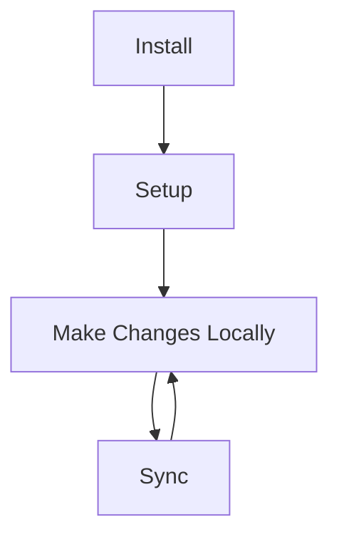

# VCSync (yes the title is a work-in-progress)

A quick and easy way to use Git for syncing your vault. Built on a plug-and-play emphasis with minimal setup and usage.

## Usage

## Prerequisites
- [Git](https://git-scm.com/downloads) should be installed.
- A **empty** remote repository to push to, with a valid url. The branch can only be master.
- You are logged into your GitHub Account from your device.
- You must have access to the repository you are pushing to.
- Any files/folders you'd like to ignore must be added to a .gitignore in the vault seperately.

## Installation & Setup
- Download vcsync.zip from the latest [Release](https://github.com/Isuru2701/VCSync/releases).
- Open the vault from your file explorer.
- Extract the ZIP into /.obsidian/plugins/vsync/ (if /plugins/ doesn't exist, make the folder).
- Open Obsidian >> Settings >> enable Community Plugins if it isn't already.
- VCSync should appear in the list, toggle it to enable the plugin.
- Click on the settings icon and input the current remote url and **click register remote**.
- A folder-sync icon should appear in the left ribbon menu, click on that periodically to update your repo.

!! WARNING !!
The pull function may not work as intended and may put the repository in an unpredictable state.
**Please make sure you have a backup of your notes elsewhere, just in case, as the plugin is still in production. I am not responsible for any lost data.**

If pushing fails, please try restarting the app. If the issue persists, raise an [issue](https://github.com/Isuru2701/VCSync/issues).

If you would like to contribute to this project or customize this plugin, please feel free to fork this repository.

## TODO
- [x] Setup for correct vault (autodetect)
- [x] Figure out how to automate git vcs.
- [x] Add and edit remote.
- [x] Push to remote by pressing a button.
- [x] Commit message set to datetime.
- [x] Generate errors for:
  - [x] Git not found.
  - [x] Push failed. 
  - [x] Repo access denied.
- [ ] Pulling.
- [ ] Stylizing changes.
- [ ] Message Customization.
- [ ] Automatic pushes at a set interval.

## Aren't there other existing plugins?

There's a lot of great plugins that use GitHub as a sync for a vault. But none of them met the requirements that I needed.
I wanted a plugin that was:
- Simple: I want to be able to update my remote vault with the push of a button.
- Easy to setup: Most plugins I had tried had issues with setup. Maybe that's on me. Maybe that's on them. I wanted one that works.
- Graphical:  I wanted one that would do all this with the click of a button, instead of having to run commands with a the command palette.
