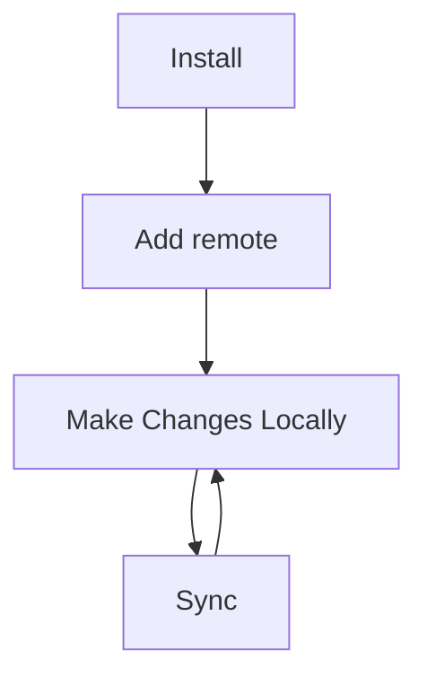

# VCSync (title is a work-in-progress)

A quick and easy way to use Git for syncing your vault. Built on a plug-and-play emphasis with minimal setup and usage.

## Usage

## Prerequisites
- [Git](https://git-scm.com/downloads) should be installed.
- You are logged into your GitHub Account from your device.
- A repository to push to, with a valid url.
- You have access to the repository you are pushing to.
## TODO
- 
- [ ] Add and edit remote.
- [ ] Sync with remote by pressing a button.
- [ ]
- [ ] Generate errors for:
  - [ ] Git not found.
  - [ ] Repo access denied.
  - [ ]  

## Aren't there other existing plugins?

There's a lot of great plugins that use GitHub as a sync for a vault. But none of them met the requirements that I needed.
I wanted a plugin that was:
- Simple: I want to be able to update my remote vault with the push of a button.
- Easy to setup: Most plugins I had tried had issues with setup. Maybe that's on me. Maybe that's on them. I wanted one that works.
- Graphical:  I wanted one that would do all this with the click of a button, instead of having to run commands with a the command palette.